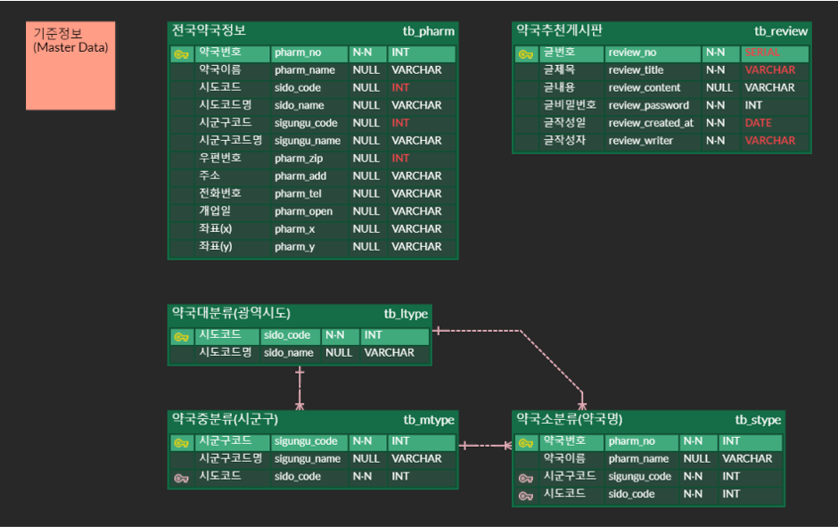

# 🗂️ 2023 ITO사업부

> 서비스 이름 : 모든약국
> 
> 서비스 소개 : 전국 약국 정보 공공 데이터(.csv) 활용하여 시각화(표/차트) 및 게시판 구현
> 
> 제작기간 : 2023-08-10 ~ 2023-09-13
> 
> 개발자 : [이수경](https://github.com/code-sum)

#### Dev Environments

         

- Programming Language : Java 8, XML
- Script Language (Server) : JSP
- Script Language (Client) : JavaScript
- Framework : Spring (v4.3.16), MyBatis (v3.4.1)
- Library : amCharts 5, Jsoup (v1.16.1), jQuery (v1.11.2), Bootstrap (v5.3.1)
- SCM : Git (v2.41.0)
- Web : HTML 5, CSS 3
- Server : Apache Tomcat (v8.5.91)
- IDE : Eclipse (eGovFrameDev - v3.8.0)
- DB : PostgreSQL (v13.12), DBeaver (v23.2.0)
- Tools : Ajax (v1.5.7), JSON, Figma

#### Requirements

- RQ-001 [반영완료] 필수·기능 | 사용자가 CRUD 할 수 있는 게시판 구현
- RQ-002 [반영완료] 필수·기능 | 공공 데이터(.csv) 기반 표&차트 시각화
- RQ-003 [반영완료] 선택·기능 | API 호출
- RQ-004 [반영완료] 선택·성능 | DB 성능 고려한 테이블 설계 및 기능 구현
- RQ-005 [반영완료] 선택·환경 | 형상관리 시, Commit Convention 준수

#### E-R Diagram

#### Implementation

- [메인화면 <실시간 뉴스> 기능](markdown/01-메인뉴스.md)
- [메인화면 <데이터 검색 및 목록 조회> 기능](markdown/02-메인검색.md)
- [메인화면 <데이터 1건 조회> 기능](markdown/03-메인1건.md)
- [시각화 <지역별 약국 현황> 기능](markdown/04-시각화.md)
- [게시판 <데이터 검색> 기능](markdown/05-게시판검색.md)
- [게시판 <데이터 생성 및 유효성 검사> 기능](markdown/06-게시판생성.md)
- [게시판 <데이터 목록 조회> 기능](markdown/07-게시판목록.md)
- [게시판 <데이터 1건 조회 및 비밀번호 검사> 기능](markdown/08-게시판1건.md)
- [게시판 <데이터 수정 및 비밀번호/유효성 검사> 기능](markdown/09-게시판수정.md)
- [게시판 <데이터 삭제 및 비밀번호 검사> 기능](markdown/10-게시판삭제.md)
