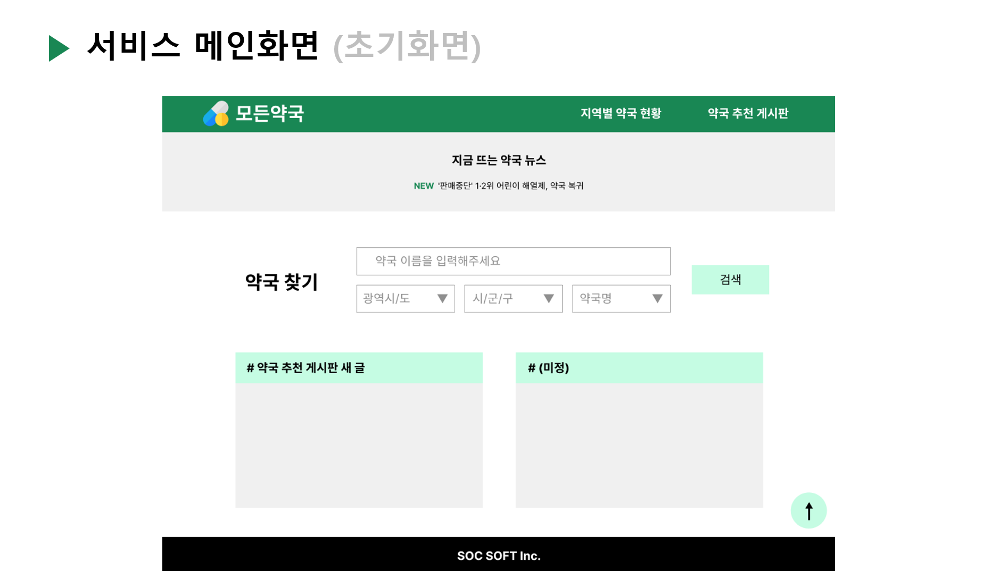

# [⬅️](https://github.com/code-sum/ITO_Dev) 메인화면 <실시간 뉴스> 기능구현

## 1. 구현완료 화면

## 2. 소스코드
- Java
  - 파일경로 `/src/main/java/egovframework/example/crawl/web/CrawlController.java`
  - [소스코드](../src/main/java/egovframework/example/crawl/web)
- JSP
  - 파일경로 `/src/main/webapp/WEB-INF/jsp/egovframework/example/cmmn/newsListGrd.jsp`
  - [소스코드](../src/main/webapp/WEB-INF/jsp/egovframework/example/cmmn)

## 3. 화면설계
