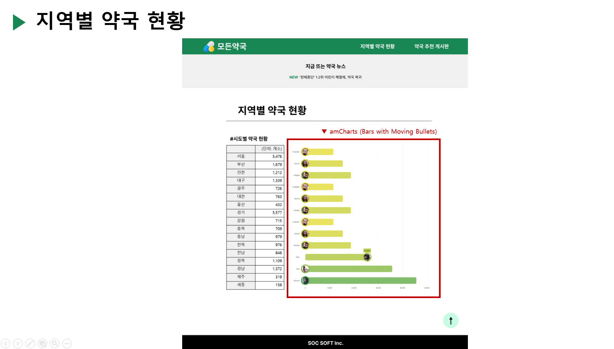

# [⬅️](https://github.com/code-sum/ITO_Dev) 시각화 <지역별 약국 현황> 기능구현

## 1. 구현완료 화면

## 2. 소스코드
- Java
  - 파일경로 `/src/main/java/egovframework/example/region`
  - [소스코드](../src/main/java/egovframework/example/region) 
- SQL
  - 파일경로 `/src/main/resources/egovframework/sqlmap/example/mappers/Region_SQL.xml`
  - [소스코드](../src/main/resources/egovframework/sqlmap/example/mappers/Region_SQL.xml)
- JSP
  - 파일경로 `/src/main/webapp/WEB-INF/jsp/egovframework/example/region`
  - [소스코드](../src/main/webapp/WEB-INF/jsp/egovframework/example/region) 

## 3. 화면설계
